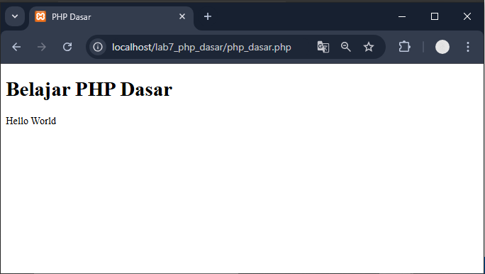
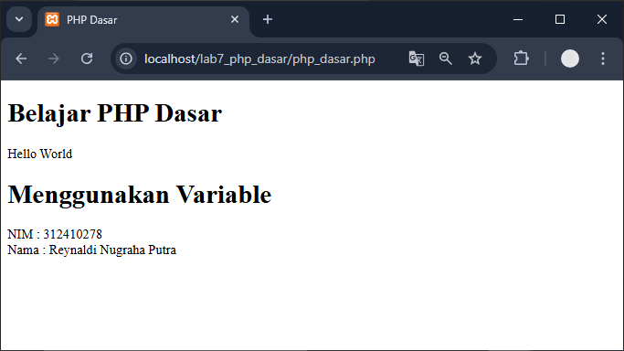
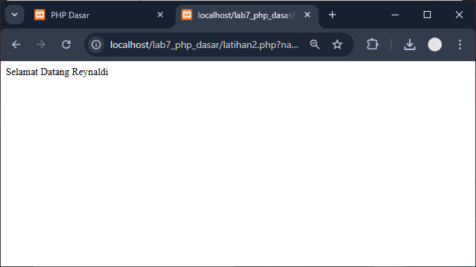
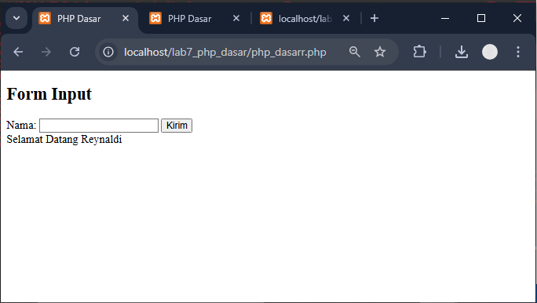
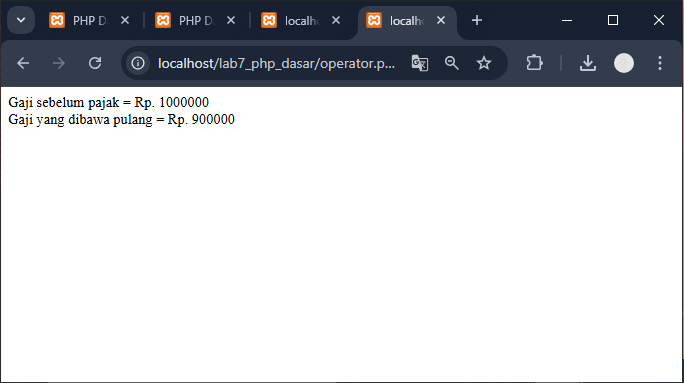
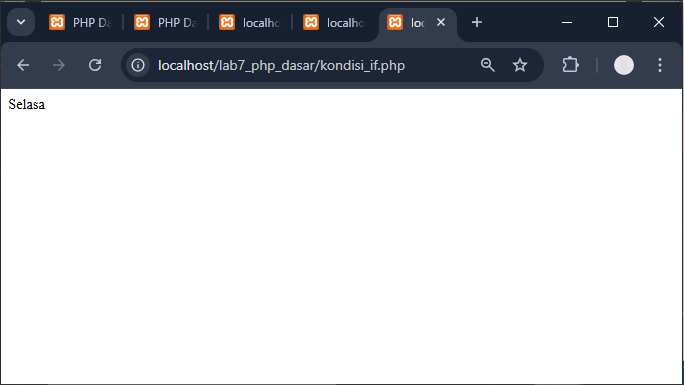
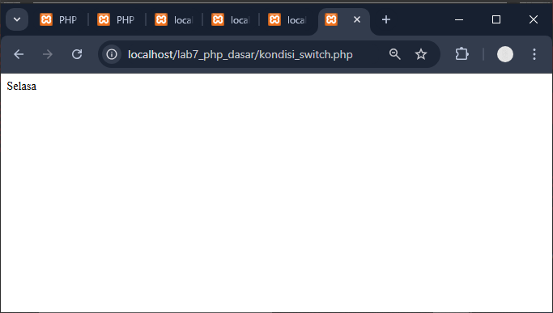
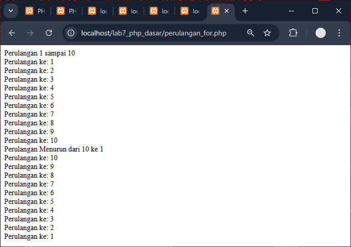
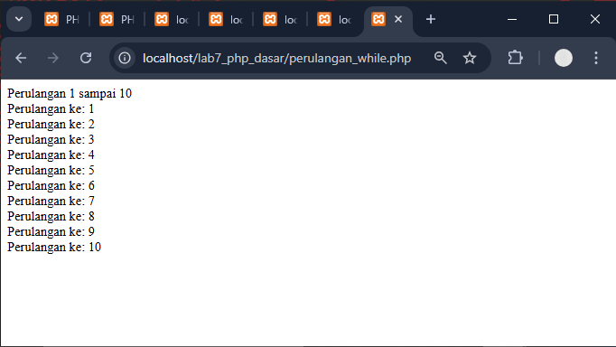
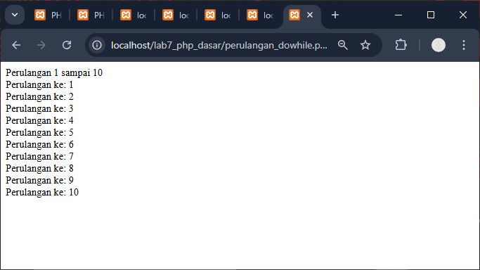

# Praktikum 7-PHP Dasar
Nama : Reynaldi Nugraha Putra <br>
NIM  : 312410278 <br>
Kelas : TI.24.A.3 <br>
Matakuliah : Pemrograman Web Pert 9 <br>

### 1. PHP Dasar
File: `php_dasar.php`
```
<!DOCTYPE html>
<html lang="en">
<head>
    <meta charset="UTF-8">
    <title>PHP Dasar</title>
</head>
<body>
    <h1>Belajar PHP Dasar</h1>
    <?php
        echo "Hello World";
    ?>
</body>
</html>
```
### Penjelasan
- Baris 1–6: Struktur dasar HTML.
- Baris 7: Tag `<h1>` menampilkan judul halaman.
- Baris 8–10: Bagian PHP dimulai dengan `<?php` dan diakhiri `?>`.
- `echo "Hello World";` digunakan untuk menampilkan teks di browser.

Output:


### 2. Variabel PHP
File: `variabel.php`
```
<?php 
$nim = "312410278"; 
$nama = 'Reynaldi Nugraha Putra'; 
echo "NIM : " . $nim . "<br>"; 
echo "Nama : $nama"; 
?> 
```
### Penjelasan
- `$nim` dan `$nama` adalah variabel.
- Tanda titik (`.`) digunakan untuk menggabungkan string dan variabel.
- `<br>` menambah baris baru di HTML.

Output:


### 3. Predefined Variable `$_GET`
File: `latihan2.php`
```
<?php
echo 'Selamat Datang ' . $_GET['nama'];
?>
```
### Penjelasan
- `$_GET['nama']` mengambil data dari URL.
- Contoh: `http://localhost/lab7_php_dasar/latihan2.php?nama=Reynaldi`
- maka hasilnya


### 4. Form Input (Metode Post)
File: `form_input.php`
```
<!DOCTYPE html>
<html lang="id">
<head>
    <meta charset="UTF-8">
    <title>Form Input</title>
</head>
<body>
<h2>Form Input</h2>

<form method="post">
    <label>Nama:</label>
    <input type="text" name="nama">
    <input type="submit" value="Kirim">
</form>

<?php
if (isset($_POST['nama'])) {
    echo 'Selamat Datang ' . htmlspecialchars($_POST['nama']);
}
?>
</body>
</html>
```
### Penjelasan
- `method="post"`: data dikirim melalui HTTP POST.
- `isset($_POST['nama'])`: memastikan input sudah dikirim agar tidak muncul error.
- `htmlspecialchars()` mencegah script berbahaya dimasukkan ke input.
Hasil:


### 5. Operator Aritmatika
File: `operator.php`
```
<?php
$gaji = 1000000;
$pajak = 0.1;
$thp = $gaji - ($gaji * $pajak);
echo "Gaji sebelum pajak = Rp. $gaji <br>";
echo "Gaji yang dibawa pulang = Rp. $thp";
?>
```
### Penjelasan
- `$gaji` = nilai awal gaji.
- `$pajak` = 10% dari gaji.
- `$thp` = hasil perhitungan gaji bersih.
- Operator `-` dan `*` digunakan untuk pengurangan dan perkalian.
Output:


### 6. Kodisi IF
File: `kondisi_if.php`
```
<?php
$nama_hari = date("l");
if ($nama_hari == "Sunday") {
    echo "Minggu";
} elseif ($nama_hari == "Monday") {
    echo "Senin";
} else {
    echo "Selasa";
}
?>
```
### Penjelasan
- `date("l")` menghasilkan nama hari (Sunday, Monday, dll).
- `if`, `elseif`, dan `else` digunakan untuk membandingkan nilai.
- Hasil akan berbeda tergantung hari saat dijalankan.
Output:


### 7. Kondisi SWITCH
File: `kondisi_switch.php`
```
<?php
$nama_hari = date("l");
switch ($nama_hari) {
    case "Sunday":
        echo "Minggu";
        break;
    case "Monday":
        echo "Senin";
        break;
    case "Tuesday":
        echo "Selasa";
        break;
    default:
        echo "Sabtu";
}
?>
```
### Penjelasan
- `switch` digunakan untuk memilih kondisi dari banyak kemungkinan.
- `break` menghentikan eksekusi setelah satu kondisi cocok.
Output:


### 8. Perulangan FOR
File: `perulangan_for.php`
```
<?php
echo "Perulangan 1 sampai 10 <br />";
for ($i = 1; $i <= 10; $i++) {
    echo "Perulangan ke: " . $i . '<br />';
}

echo "Perulangan Menurun dari 10 ke 1 <br />";
for ($i = 10; $i >= 1; $i--) {
    echo "Perulangan ke: " . $i . '<br />';
}
?>
```
### Penjelasan
- `for` digunakan untuk perulangan dengan batas tertentu.
- `$i++` menaikkan nilai, `$i--` menurunkan nilai.
Output:


### 9. Perulangan While
File: `perulangan_while.php`
```
<?php
echo "Perulangan 1 sampai 10 <br />";
$i = 1;
while ($i <= 10) {
    echo "Perulangan ke: " . $i . '<br />';
    $i++;
}
?>
```
### Penjelasan
- Perulangan terus berjalan selama kondisi `$i <= 10` terpenuhi.
- `$i++` meningkatkan nilai variabel setiap loop.
Output:


### 10. Perulangan DO WHILE
File: `perulangan_dowhile.php`
```
<?php
echo "Perulangan 1 sampai 10 <br />";
$i = 1;
do {
    echo "Perulangan ke: " . $i . '<br />';
    $i++;
} while ($i <= 10);
?>
```
### Penjelasan
- `do...while` menjalankan blok kode setidaknya satu kali, baru memeriksa kondisi.


## Tugas
File: `tugas.php`
```
<!DOCTYPE html>
<html lang="id">
<head>
    <meta charset="UTF-8">
    <title>Form Data Diri</title>
</head>
<body>
<h2>Form Input Data Diri</h2>

<form method="post">
    <label>Nama:</label>
    <input type="text" name="nama"><br><br>

    <label>Tanggal Lahir:</label>
    <input type="date" name="tgl_lahir"><br><br>

    <label>Pekerjaan:</label>
    <select name="pekerjaan">
        <option value="Programmer">Programmer</option>
        <option value="Desainer">Desainer</option>
        <option value="Manager">Manager</option>
    </select><br><br>

    <input type="submit" value="Kirim">
</form>

<?php
if (isset($_POST['nama']) && isset($_POST['tgl_lahir']) && isset($_POST['pekerjaan'])) {
    $nama = $_POST['nama'];
    $tgl_lahir = $_POST['tgl_lahir'];
    $pekerjaan = $_POST['pekerjaan'];

    // Hitung umur
    $umur = date_diff(date_create($tgl_lahir), date_create('today'))->y;

    // Tentukan gaji berdasarkan pekerjaan
    switch ($pekerjaan) {
        case "Programmer": $gaji = 10000000; break;
        case "Desainer": $gaji = 8000000; break;
        case "Manager": $gaji = 12000000; break;
        default: $gaji = 0;
    }

    echo "<h3>Hasil:</h3>";
    echo "Nama: $nama <br>";
    echo "Tanggal Lahir: $tgl_lahir <br>";
    echo "Umur: $umur tahun <br>";
    echo "Pekerjaan: $pekerjaan <br>";
    echo "Gaji: Rp " . number_format($gaji, 0, ',', '.');
}
?>
</body>
</html>
```
### Penjelasan
- `isset()` memastikan semua input sudah dikirim.
- `date_diff()` menghitung selisih tahun antara tanggal lahir dan hari ini.
- `switch` menentukan besaran gaji.
- `number_format()` membuat tampilan gaji lebih rapi.
Output:

